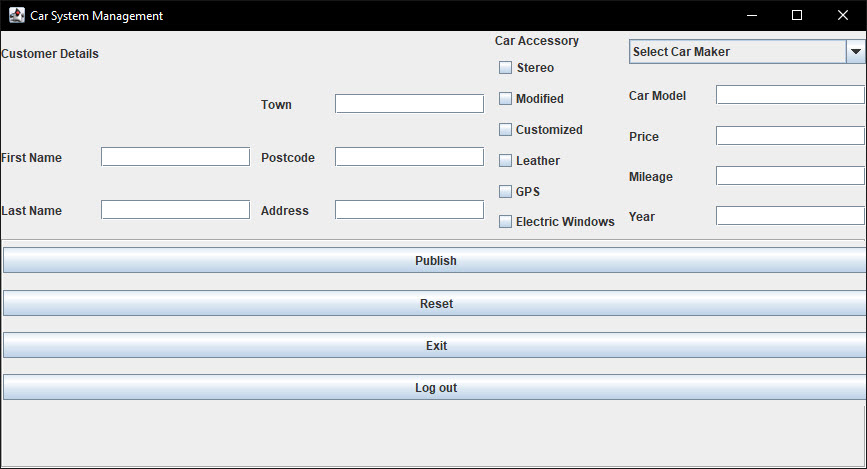

# CarDealerManagementSystem

My first Java app using Swing.

Instructions:

1. For admin account use username: admin and password: admin, for username: user and password: user or just simply create new account.

Login page: 

Admin view: 

User view:  

